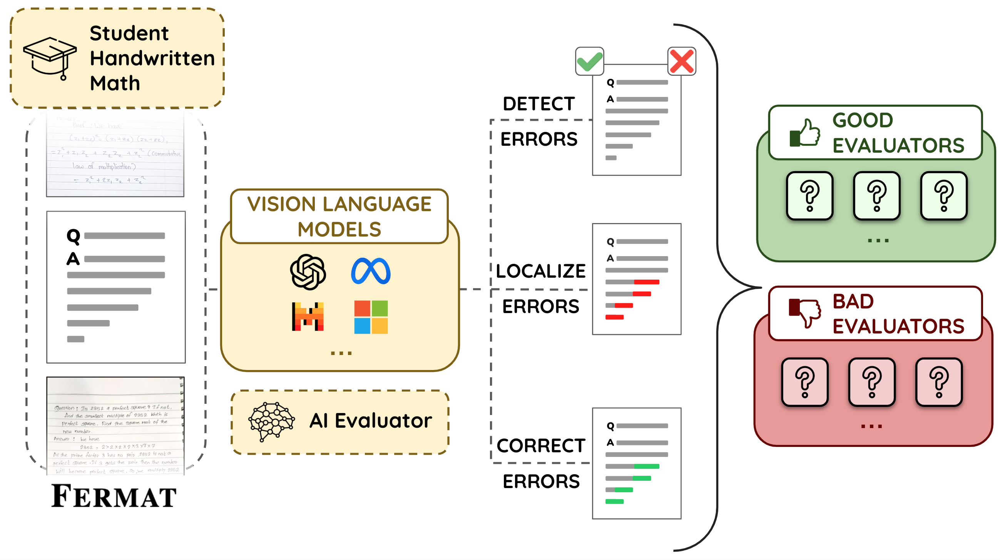

# FERMAT: Can Vision-Language Models Evaluate Handwritten Math?

[📜 Paper](https://arxiv.org/abs/2501.07244) | [🤗 HF Dataset](https://huggingface.co/datasets/ai4bharat/fermat)

We present FERMAT, a benchmark designed to assess VLMs’ ability to detect, localize and correct errors in handwritten mathematical content. Please refer to our [paper]() for more details.

<p align="center" width="100%">
      
</p>

## VLMs

- [ ] Gemini Family
- [ ] GPT Family
- [x] Pixtral Family
- [x] Llama Family
- [x] Phi3.5V

## Loading Data

Steps to download data and store the images in benchmark_images, and csv in benchmark_csv.
Steps to dowload data for the oikantik format

## Setup

To run evaluation of VLMs against the FEMRAT dataset, you need to install the required packages by running the following command:

```bash
pip install -r requirements.txt
```

We self-hosted Pixtral-12B-2409 (https://huggingface.co/mistralai/Pixtral-12B-2409), Pixtral-Large-Instruct-2411, LLaMa-3.2-11B-Vision-Instruct, LLaMa-3.2-90B-Vision-Instruct, Phi-3.5-Vision-Instruct using VLLM (https://github.com/vllm-project/vllm)

We used hosted services for GPT-Family, Gemini-Family

For self-hosted models,

1. Set up environment variables:

   ```bash
   export OPENAI_API_BASE=[ADD_THE_ENDPOINT_URL_OF_HOSTED_MODEL]
   ```

   Example: "http://localhost:8004/v1"

2. Start Evaluations:

   ```bash
   python main.py --model [MODEL_NAME] --dir_name [DATA_DIR]
   ```

   - MODEL_NAME: Name of the model to be evaluated. Choices: `['pixtral', 'pixtral_large', 'phi', 'llama_large', 'llama']`
   - DATA_DIR: Path to the directory where the Benchmark Images are stored

3. Fill-in CSV

   Once the evaluation is done, the results will be stored in a JSON File with the format `state_<MODEL_NAME>.json`. You can convert this JSON file to a CSV file using the following command:

   ```bash
   python fill_in_csv.py --model [MODEL_NAME] --csv-file [CSV_FILE] --json-file [JSON_FILE]
   ```

   - MODEL_NAME: Name of the model to be evaluated. Choices: `['pixtral', 'pixtral_large', 'phi', 'llama_large', 'llama']`
   - CSV_FILE: Path to the CSV file where the results need to be filled in.
   - JSON_FILE: Path to the JSON file where the results are stored.

## Evaluation

### Error Detection

### Error Localization

### Error Correction

## Citation

If you used this repository or our models, please cite our work:

```bibtex
@misc{nath2025visionlanguagemodelsevaluatehandwritten,
      title={Can Vision-Language Models Evaluate Handwritten Math?},
      author={Oikantik Nath and Hanani Bathina and Mohammed Safi Ur Rahman Khan and Mitesh M. Khapra},
      year={2025},
      eprint={2501.07244},
      archivePrefix={arXiv},
      primaryClass={cs.CV},
      url={https://arxiv.org/abs/2501.07244},
}
```
